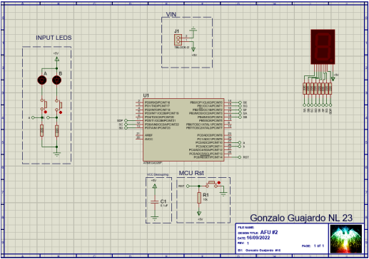

# 7-Segment Display Controlled by Atmega328P Microcontroller

## Overview
This project is designed to control a 7-segment display using an Atmega328P microcontroller. The C code utilizes the microcontroller's ports to display numbers on the display. Additionally, functionalities are included to interact with the display using buttons.

## Components
- Atmega328P Microcontroller
- 7-Segment Display
- Two buttons for increment and decrement control

## Code Description
- **Libraries**: Standard libraries necessary for the Atmega328P microcontroller and for managing delays are included.
- **Constants and Macros**: Constants like oscillator frequency and macros for bit manipulation are defined.
- **Input and Output Ports**: Input ports for buttons and output ports for display segments are defined.
- **Numbers Array**: An array is created to store segment patterns for each hexadecimal digit.
- **Functions**:
  - `init_port()`: Initializes ports as inputs or outputs as appropriate.
  - `display_num(uint8_t output)`: Displays a number on the 7-segment display.
- **Main Function (`main()`)**:
  - Initializes ports.
  - Within an infinite loop, it checks the state of buttons and displays a number on the 7-segment display based on user actions.

## Usage
Users can interact with the display using the two buttons:
- Button 1: Increments the number displayed on the display.
- Button 2: Decrements the number displayed on the display.

## Hardware Setup
Ensure the 7-segment display and buttons are correctly connected to the microcontroller according to the port definitions in the code.

## Compilation and Execution
- Use a C compiler to compile the code and generate a binary file.
- Upload the binary file to the microcontroller using a compatible programmer.

## Simulation in Proteus

The functionality of this code was simulated using Proteus simulation software. The simulation setup included the Atmega328P microcontroller, the 7-segment display, and the two control buttons.

The simulation demonstrated the following:
- Incrementing and decrementing numbers on the 7-segment display using the control buttons.
- Proper functioning of the display segments to represent different hexadecimal digits.

Above is a screenshot of the simulation in action. The display shows a number being incremented while the buttons are pressed accordingly.
